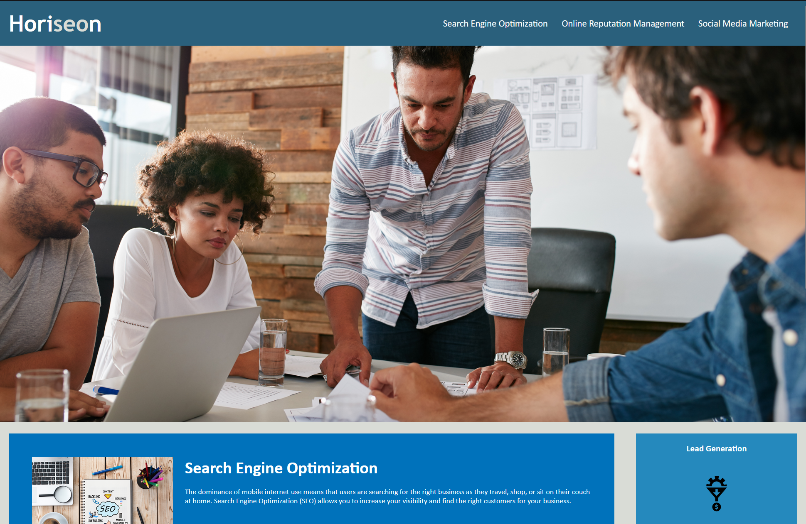
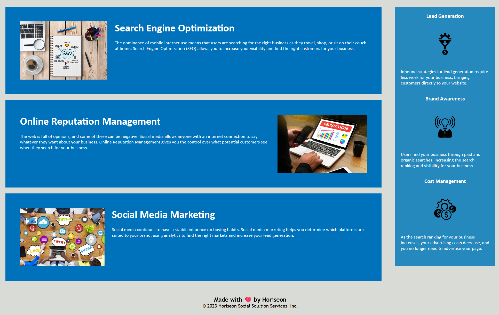

# Horiseon Landing Page

## Description

This landing/home page is a homepage for a fictional company called "Horiseon". This was given as an assignment to test our skills in optimizing code to be a much more efficient developer. A key point in this assignment besides being concise is to make it accessible for everyone, including people with disabilites. This webpage follows the following acceptance criteria:

```
GIVEN a webpage meets accessibility standards
WHEN I view the source code
THEN I find semantic HTML elements
WHEN I view the structure of the HTML elements
THEN I find that the elements follow a logical structure independent of styling and positioning
WHEN I view the icon and image elements
THEN I find accessible alt attributes
WHEN I view the heading attributes
THEN they fall in sequential order
WHEN I view the title element
THEN I find a concise, descriptive title
```

## Images





## Usage

This page was built using Github Pages, if you like to visit the webpage, [here is the link to visit](https://beyondneptune.github.io/horiseon-webpage/).

## License

Please refer to the LICENSE in the repo.
